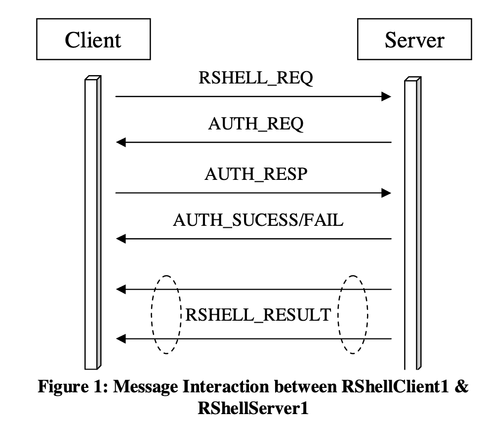
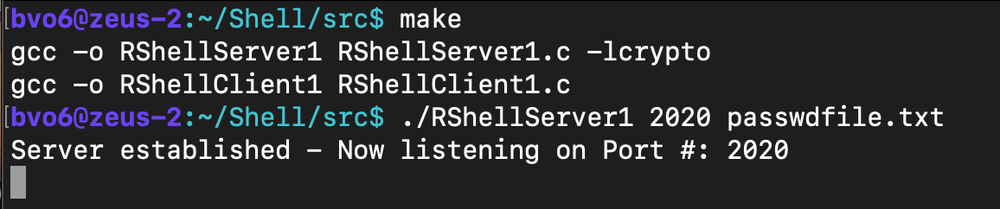
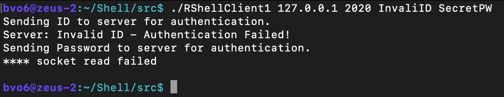
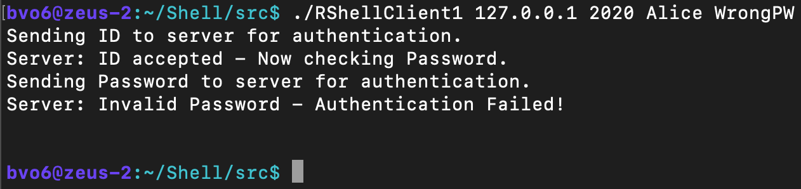
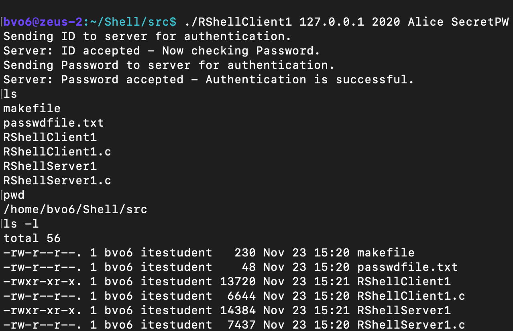

# A primitive authenticated remote shell client and server
The standard remote shell allows one to execute shell commands on a remote machine running and get execution results back. However, they do not have any authentication whatsoever.

• RShellServer1 <port number>   <password file>  will  listen  on  the  specified <port  number>  and  authenticate  the  remote  shell  command  by comparing  the  SHA1  hash  of  the password  provided  by  the  client  with  that  in  the  <password  file>.  If  the  authentication  is successful,  execute  the  shell  command  and  return  the  execution result  back  to  client.  The <password file> should contain one or more line: <ID string>; <hex of SHA1(PW)> 
 
• RShellClient1 <server IP> <server port number> <ID> <password>  will read  shell  command  from  the  standard  input  (i.e.,  the  keyboard)  and  send  the  shell  command  to the server listening at the <server port number> on <server IP>. It will provide the <ID> and the SHA1 hash of <password> to the server for authentication. 
  
# Protocol Specification 
 In  order  to  have  the  functionalities  described  above,  you  need  to  implement  the  following  protocol upon TCP between the client and server: 
 
 1. The client sends a RSHELL_REQ message that includes the client’s ID and the shell command to the server. 
 
 2. The  server  responds  with  an AUTH_REQ  message  the  client  –  asking  the  client  to  provide  the password. 
 
 3. The  client  sends  an AUTH_RESP  message  to  the  server  –  responding  with  the  SHA1  hash  of  its password.
 
 4. The  server  verifies  the  received  SHA1  hash  with  the  SHA1 hash  of  the  password  in  the <password  file>.  If  it  does  not  match,  the  server  sends  an AUTH_FAIL  message  to  the  client. Otherwise,  a)  the  server  sends  an AUTH_SUCCESS  message  to  the  client;  b)  the  server  executes the  shell  command  from  the  client  and  sends  the  result  back  to  the  client  via RSHELL_RESULTmessage(s). 
  
 5. If  the  client  receives AUTH_FAIL  message  from  the  server,  it  should  print  out  an  error  message “Authentication  failed”  and  exit  gracefully.  If  the  client  receives AUTH_SUCESS  message,  it should print out the shell command result received from RSHELL_RESULT message(s). Here the server  may  send  one  or  multiple RSHELL_RESULT  messages  depending  on  the  volume  of  the result. The client should be able to handle multiple RSHELL_RESULT messages. 
 
 
 
# Message Format 
 
 For  message  RSHELL_REQ, the  “Shell  Command”  is  simply  the shell  command  the  client  is  trying to execute at the remote host (e.g., “pwd”). It is null terminated string.  
 
For  message  AUTH_RESP,  the  SHA1(PW)  is  the  20  byte  (160  bits) SHA1  hash  of  the  ID’s password. Note the SHA1(PW) hash is random binary value, you should treat it as raw byte stream. 

For message RSHELL_RESULT, MR (more result) is a 1-byte field representing if there is any more execution  result  after  the  current  RSHELL_RESULT  message. If  there  is  no  more  execution  result, MR  field  should  be  zero.  Otherwise,  WR  should  be  non-zero. The  “Execution  Result”  is  simply  the execution result of the shell command at the remote host. Normally it should be printable ascii string. But  it  could  contain  unprintable  char  (e.g.,  if  you  trying  to  display  a  binary  file).  You  want  to  make sure to print every byte in the “Execution Result” even if there is null in the middle. 

# Experiments:
1) Create a text mode password file named passwdfile.txt that contains the following line:      
   Alice; <hex representation of SHA1(PW)> where “Alice” is a recognized ID, and the PW is “SecretPW”. 
   Note you can obtain the SHA1  of “SecretPW” via appropriate OpenSSL command. 

2) Run ./RShellServer1 <port num> passwdfile.txt  Here  you  want  to  choose  some random port num between [1025, 65535]. 
 If someone else is using the port num you picked, your server won’t be able to bind it. You can try some other port number. 
  
3) Run ./RShellClient1  localhost  <port  num>  InvalidID  SecretPW.
  The server should reject any shell command it sends as InvalidID is not defined in the passwdfile.txt 
  
4) Run ./RShellClient1  localhost  <port  num>  Alice  WrongPW 
  The   server should reject any shell command  it sends as the SHA1 hash of WrongPW does not  match that in passwdfile.txt 
  
5) Run ./RShellClient1 localhost <port num> Alice SecretPWand  type  the following shell commands:  
   1)id 
   2)date 
   3)pwd 
   4)ls -l 
  The  server  should  accept  and  execute  any  shell  command  it sends  and  return  the  execution  result to the client. The client should print out the execution result on screen. 
 
 # Sample Run
  Server establishes a connection using the provided sha1 password.
  
 
 
  Client attempts to connect to the port using invalid ID.
  
  
 
  Client attempts to connect to the port using invalid password.
  
  
  
  Successful connection.
  
  
 
